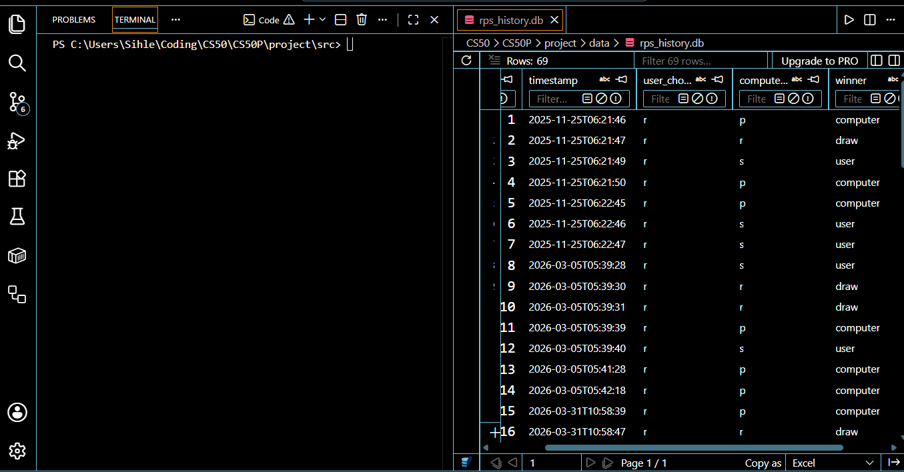

# Rock-Paper-Scissors CLI Game (Advanced DevOps & Architecture)

[](https://hub.docker.com/r/itsmesihle/rps-cli-game)


A clean, modular, and fully logged Rock–Paper–Scissors game written in **Python**. This project demonstrates professional OOP principles, architectural separation, automated testing, file handling and output logging, and input validation.


> 📖 **Read the Full Architectural Case Study:** I wrote a comprehensive deep-dive on Medium detailing exactly how this application was refactored from a tight script into a decoupled, enterprise-ready system. Check out the article here: **[From Script to System: Embracing Loose Coupling and Dependency Injection in Python](https://medium.com/@itsmesihle/from-script-to-system-embracing-loose-coupling-and-dependency-injection-in-python-162461da29c4)**
___

## 📚 Table of Contents

- [Project Description & Value Proposition](#-project-description--value-proposition)
- [Deployment and Execution](#️-deployment-and-execution)
- [System Architecture](#️-system-architecture)
- [Technical Challenges & Solutions](#-technical-challenges--solutions)
- [Skills Showcased](#-skills-showcased)
- [Codebase Layout & Dependency Management](#-codebase-layout--dependency-management)
- [Project Roadmap](#-project-roadmap)
- [License](#-license)
- [Author & Attribution](#-author--attribution)
- [Connect with Me](#-connect-with-me)

---

## 📌 **Project Description & Value Proposition**

This console-based Rock-Paper-Scissors system transforms a historically simple game into a robust, enterprise-grade architecture. Built to demonstrate advanced software engineering workflows, the project models clean Object-Oriented Programming (OOP) principles, rigorous test-driven design, and containerized deployment infrastructure.

### The Core Experience


The application greets players with dynamic ASCII-art title sequences before prompting them for an interactive session layout:



During live gameplay, the user is prompted to select their move:
* **(r)** Rock
* **(p)** Paper
* **(s)** Scissors

The engine evaluates input rules, determines the outcome, and seamlessly executes an atomic database transaction. Match metrics including precise synchronized UTC timestamps, running scores, and session states are committed to a relational SQLite engine.

Upon a graceful or forced session exit, a finalized statistical scoreboard summary is generated, and a local historical CSV audit trail is updated, ensuring complete data consistency across both flat-file and relational storage layers.

---

## ▶️ Deployment and Execution

You can run this system either as a local Python script or as an isolated, containerized environment using Docker.

### Option A: Running via Docker Hub Container (Recommended)

This system is fully containerized and published to Docker Hub. You do not need Python, Git, or any local dependencies installed on your host system - only Docker.

**1. Pull the public image directly from Docker Hub:**

```bash
docker pull itsmesihle/rps-cli-game:latest
```

**2. Execute interactive game loop within container:**

```bash

docker run -it itsmesihle/rps-cli-game:latest
```

### ▶️ **Option B: Running as a Standard Local Python Script**
Requires Python >= 3.10 and a standard terminal environment


**1. Navigate to your project path/location:**

```bash
cd path/to/your/project
```

**2. Install core dependencies:**

```bash
# --- Automatically install dependencies ---

pip install -r requirements.txt
```

OR

```bash
# --- Manually install dependencies ---

pip install pyfiglet pytest
```

**3. Run the game:**

```bash
python src/project.py
```

**4. Execute automated tests:**

```bash
python -m pytest tests/test_project.py
```

**5. Inspect historical data:**

```bash
python src/view_results.py
```

---

## 🏗️ System Architecture

The project utilizes a **Layered Orchestration** model following strict clean architecture principles. Application files are split by module to enforce clear boundaries between stateless execution rules and stateful persistence.

| Layer | Class | Responsibility |
| :--- | :--- | :--- |
| **Orchestrator** | `GameEngine` | The "brain" that co-ordinates UI, Core Logic, and Storage. |
| **Core Logic** | `RPSGame` | Handles pure mathematical game rules, win/loss scenarios and move validation. |
| **Data** | `GameDataManager` | Manages relational interactions with the SQLite engine. |
| **UI** | `GameUI` | Manages ASCII art, screen updates, user input and terminal presentation. |
| **Migrations** | Script Engine | Transforms legacy flat CSV rows into SQL schemas. |
| **Storage & Analysis** | Script Engine | Standard SQL aggregations querying historic metric trends. |

---

## 🧩 **Technical Challenges & Solutions**

### 1. **Architecting for Scalability: From Procedural to Modular OOP**

My initial implementation of the game began as a single procedural script where logic, file I/O, and UI were all tightly coupled. This created a brittle environment where changing a simple data-saving rule risked breaking the entire application flow. To address this, I refactored the codebase into a modular, object-oriented architecture centered on the Separation of Concerns.

By isolating responsibilities into specialized classes; a `GameDataManager` for file I/O, a `WelcomeMessage` for UI, and a `RPSGame` for core rules. I transformed a simple script into a scalable system. By applying Separation of Concerns (SoC) and Object-Oriented Programming (OOP) to decouple the UI, Logic, and Data layers, I've ensured maximum maintainability and a clear path for future feature expansion.

### 2. Architecting for Testability and Continuous Integration

In the early development phase, the game’s mathematical logic was tightly coupled with its terminal-based display, creating a "Human Dependency" trap where input() prompts and print() statements were embedded directly within the core rules. This made automated testing with `pytest` impossible, as the test suite would "hang" indefinitely waiting for manual user input that didn't exist in a scripted environment. To resolve this, I refactored the architecture by extracting all terminal interactions into a dedicated UI Layer and converting the RPSGame class into a collection of pure functions. By ensuring the logic layer only accepts arguments and returns values, I successfully decoupled the engine from the console, achieving 100% test coverage for the core game mechanics.

To move beyond manual local testing, I evolved the project by integrating a CI/CD pipeline via GitHub Actions, authoring a YAML workflow that provisions a fresh Ubuntu Linux environment on every code push.

The final result is a "production-ready" workflow where potential "breaking changes" are caught instantly in a neutral environment before they can ever reach the main branch. This architectural shift demonstrates a professional commitment to modern DevOps standards, data integrity, and software reliability. By treating the codebase as a verifiable system rather than just a functional script, the project is now highly maintainable and prepared for further scaling or migration to more complex data layers.

This automated system handles the entire lifecycle of a test run: it sets up the environment, installs necessary project dependencies, and executes the full suite of `pytest` cases in the cloud via a YAML workflow. This transition ensures the core engine remains robust and protected against regression.

### 3. Data Integrity and Handling Non-Deterministic User Exits

One of the more nuanced challenges involved handling user exits; specifically, ensuring that session data wasn't lost when a player used the `q` command to quit. Originally, the exit logic bypassed the data-logging routines, resulting in "dangling" sessions and incomplete history logs.

I addressed this by implementing a formalized "aborted" state within the GameRound model. This allows the system to catch a quit signal as a valid lifecycle event, triggering a graceful shutdown that timestamps and logs the final state to the CSV before termination. This focus on data integrity ensures a reliable and complete audit trail for every user session, regardless of how the game ends.

### 4. Repository Management: Metadata and Cross-Platform Integrity

As the project progressed, I encountered a "noisy" version control history where machine-generated caches (`__pycache__`) and local game data (`RPS_game_data.csv`) were being tracked. The challenge was to remove these files from the remote history without deleting the actual data from my local development environment. I resolved this by using the `git rm --cached` command, which surgically untracked the files while preserving the physical copies on my disk.

Furthermore, to ensure the project remained functional for developers on macOS or Linux, I implemented a `.gitattributes` file to handle line-ending normalization (LF vs CRLF). These steps ensure the repository remains lightweight, private, and functional for developers on any operating system—demonstrating a professional commitment to collaborative standards and clean configuration management, ensuring the codebase is production-ready for any environment.

---

## 🧠 Skills Showcased

### **Object-Oriented Programming**

- **Encapsulation 💊:** Grouping related data and methods into classes to reduce global state.

- **Static Methods 🧮:** Using `@staticmethod` for pure logic (determining a winner) that doesn't rely on instance data.

- **Separation of Concerns 🧱:** Dividing the project into UI, Logic, and Storage layers.

### **Defensive Programming & Reliability**

- **Input Validation ⚠️:** Robust while True loops and try/except blocks to handle non-integer inputs and invalid moves.

- **Session Integrity 📑:** Implemented custom logic to log "aborted" status when a user exits mid-session via the `'q'` command, ensuring data consistency in logs.

- **Cross-Platform Support 🔌:** Dynamic terminal clearing logic for both Windows (cls) and Unix/Mac (clear).

### **Software Engineering Best Practices**

- **Version Control 🌿:** Utilizing Git and GitHub for granular change tracking, branching strategies, and collaborative code management.

- **Automated Testing 🧪:** Developed a comprehensive suite of unit tests using pytest to verify the core logic layer and ensure 100% testability.

- **CI/CD Pipeline (GitHub Actions) 🤖:** Implemented an automated workflow to provision a Linux environment and execute tests on every push, ensuring a "fail-fast" development cycle.

- **Data Persistence 📂:** Engineered programmatic file I/O handling with the csv module, featuring automatic header initialization and session audit logging.

### **Soft Skills Demonstrated**

- **Code Documentation 📝:** Writing clear READMEs and docstrings to ensure that the "why" behind the code is just as obvious as the "how" making onboarding easier for other developers.

- **Code readability & maintainability 👓:** Prioritizing clean naming conventions and modular structure so that the codebase remains easy to navigate and update long after the initial build.

---

## 📦 Codebase Layout & Dependency Management

To maintain a clean and production-ready workspace, this repository completely segregates business logic from data storage, testing modules, and container assets. Below is the comprehensive architectural layout alongside the third-party libraries driving the core environment.

### 🧩 Project Structure

```text
.
├── .github/workflows/       # Automated GitHub Actions test pipeline YAML
    └── python-tests.yml
├── data/                    # Local storage layer (Ignored by Git in production)
├── media/                   # Assets (Images, UI screenshots, demo recordings)
├── src/                     # Core operational source package
    ├── __init__.py          # Structural package initializer
    ├── migrate_data.py      # Relational SQL schema migration pipeline
    ├── project.py           # Main application entry point and game engine
    └── view_results.py      # SQLite analytics extraction utility
├── tests/                   # Isolated test architecture
    └── test_project.py      # Pytest automated testing suite
├── .dockerignore            # Filters out caches, environments, and local binaries
├── .gitattributes           # Handles cross-platform line-ending normalization (LF)
├── .gitignore               # Keeps repository free of environment and data junk
├── Dockerfile               # Multi-layer Docker container initialization
├── README.md                # System engineering documentation
└── requirements.txt         # External dependencies manifest
```

### 🗂️ Environment Dependencies & Core Modules

To run this application, the engine utilizes a mix of Python standard built-in utilities and pinned third-party packages managed within the container environment:

#### Third-Party Packages (Installed via PyPI/Pip):
- `pytest` – Drives the automated unit testing architecture to isolate and validate the stateless core logic.
- `pyfiglet` – Implements ASCII-art rendering algorithms inside the UI layer for an immersive terminal experience.

#### Python Standard Standard Libraries:
- `random` – Powers computer move randomisation subroutines.
- `csv` & `os` – Manages local persistent auditing streams and cross-platform file paths.
- `datetime` – Generates accurate, synchronized timestamps for match metrics.

---

## 📝 **Project Roadmap**

This RPS game is still being worked on, constantly being updated

### Completed Milestone Enhancements
- Published Production-Ready Container Image - pushed the optimized multi-stage build directly to [Docker Hub (itsmesihle/rps-cli-game)](https://hub.docker.com/r/itsmesihle/rps-cli-game) for zero-dependency, single-command cloud execution.
- Migrated local history storage from flat file CSV parsing to a normalized SQLite relational schema.
- Implemented strict folder modularity isolating business code into a dedicated `/src` architecture.
- Developed comprehensive containerization parameters using custom `Dockerfile` blueprints.
- Resolved module visibility conflicts inside the remote GitHub Actions cloud virtualization matrix.

### Future Roadmap Features
- Automate Docker Hub Publishing via CI/CD.  Extend the existing GitHub Actions workflow to automatically build and push the Docker image on every tagged release.
- Implement an automated timeout fallback when users go "Away From Keyboard."
- Incorporate pattern-tracking analytics algorithms to implement dynamic game difficulty adjustment.
- Integrate a code coverage metric (`coverage.py`) target threshold of > 90% into the GitHub Actions runner.

---

## 📄 **License**

This project is licensed under the MIT License - you are free to use, modify, and distribute it.

---

## 🙌 **Author & Attribution**

Created by **Sihle Ndlovu - @itsmesihle**

This project demonstrates the transition from a functional script to a scalable, class-based application, following clean code principles learned in Harvard’s CS50P.

---

## 👋 **Connect with Me**

I am a job seeker actively looking for **Software Developer** or **Backend Python** opportunities.

This project demonstrates my proficiency in building **testable, modular Python applications**.

I welcome connection requests from recruiters and fellow developers to discuss:

- This project and the technical decisions made.
- Potential full-time roles or internships.

### **Let's Connect!**

- 🔗 [LinkedIn](https://www.linkedin.com/in/itsmesihle/)
- 📧 [Email](mailto:msihlesndlovu97@gmail.com?subject=Let's%20Connect%20-%20RPS%20-%20Game)
- 💻 [Portfolio](https://github.com/itsmesihle)
